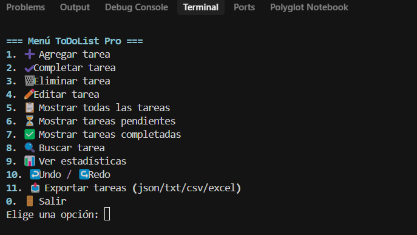
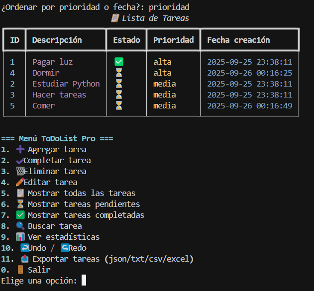
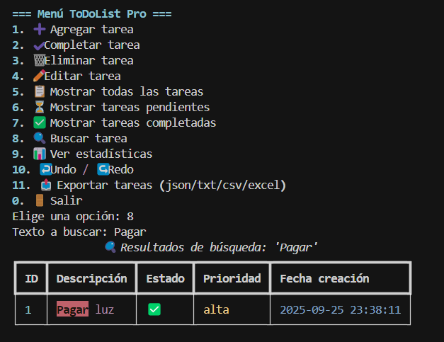
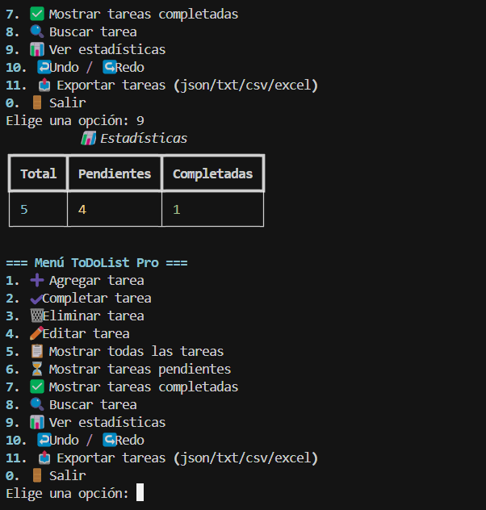
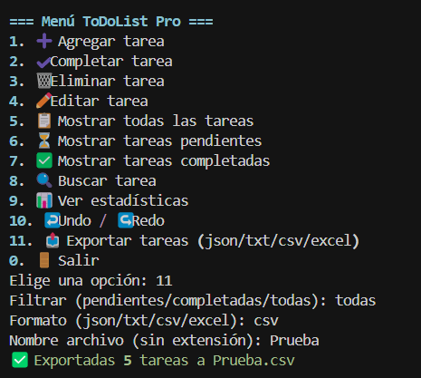
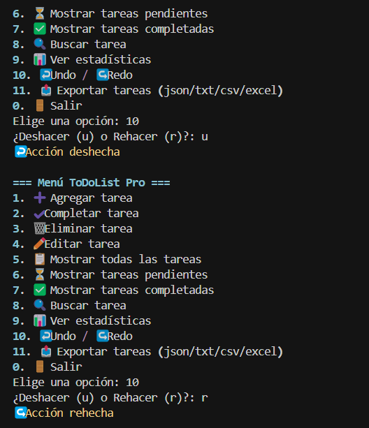
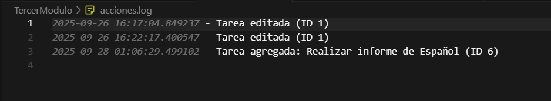

# 📝 ToDoList PRO in Python (Console)

A **console-based task manager** built with **Python 3**, using **Object-Oriented Programming (OOP)** and the **[Rich](https://github.com/Textualize/rich)** library for a more elegant terminal interface.  

This project is part of my **personal portfolio** and showcases **good development practices**, file handling, data export, and clean code organization. 

## 🚀 Features

- 📌 **Task management**: add, display, edit, search, and delete.  
- ✅ **Mark tasks as completed**.  
- 🔀 **Sort tasks** by creation date or priority.  
- 🔎 **Search with keyword highlighting**.  
- 📊 **Progress statistics** (total, pending, completed).  
- 💾 **Data persistence** in JSON and TXT.  
- 🔙 **Action history** with `logging` in `acciones.log`.  
- 🎨 **Styled console interface** using `rich`.  
- 📤 **Export tasks** in JSON, TXT, CSV, and Excel.  
- ↩️ **Undo/Redo functionality**.  

📦 ToDoList-Pro:

┣ 📜 todo_oop.py # Main code

┣ 📜 tareas.json # JSON persistence

┣ 📜 tareas.txt # Plain text export

┣ 📜 acciones.log # Action history

┣ 📜 README.md # Documentation (English)

┣ 📜 README.es.md # Documentation (Spanish)


## Installation

1️⃣ Clone this repository:

```bash
  git clone https://github.com/Fer1211/Portafolio.git
cd Portafolio/Python/ToDoList-pro
```

2️⃣ Install dependencies:
```bash
pip install rich pandas
```

3️⃣ Run the application:
```terminal
python todo_oop.py
```

💡 About the Project

ToDoList PRO is a full-featured console task manager that combines OOP, JSON/TXT file handling, and a stylish terminal interface using Rich. It’s designed to practice best coding practices, modularity, data persistence, and UX in the terminal. Whether you’re learning Python or looking to improve your workflow, ToDoList PRO offers a clean, interactive experience.

📚 Technologies

Python 3 – Core programming language

Rich – For enhanced console visualization

Pandas – Export tasks to Excel

JSON & CSV – For data persistence and export

✨ Key Features

Create, edit, and delete tasks with priorities

Organize tasks by categories or due dates

Save and load tasks from JSON or TXT files

Export task lists to Excel for reporting

Interactive terminal interface with colors and tables

🤝 Contributions & Suggestions
Contributions are welcome! If you have ideas, bug reports, or want to improve any feature, feel free to open an Issue or submit a Pull Request. Your input will help make ToDoList PRO even better.

## 📸 Preview

### Main / Menu


### Task List / Lista de Tareas


### Search Tasks / Buscar Tareas


### Statistics / Estadísticas


### Export Table / Exportar Tabla


### Undo / Redo


### Action Log / Acciones log


    

